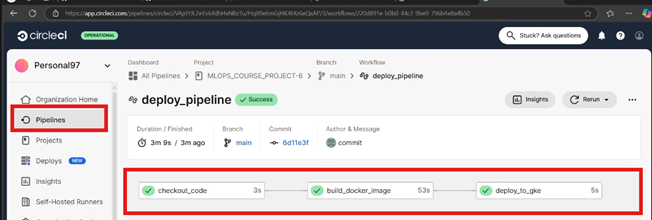
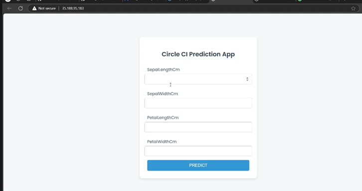

```markdown
# 🌸 FlowerPredictor

FlowerPredictor is a Deep Learning-based web application (or script) designed to identify different species of flowers from images. By leveraging Computer Vision, this project provides an automated way to classify flora with high accuracy.

## 🚀 Features
- **Image Classification:** Predicts the species of a flower from an uploaded image.
- **Deep Learning Model:** Built using [TensorFlow/Keras or PyTorch] (Specify your framework).
- **User Interface:** [Mention if it's a Streamlit app, Flask web app, or CLI tool].
- **Fast Inference:** Optimized for quick predictions.

## 🛠️ Tech Stack
- **Language:** Python
- **Libraries:** TensorFlow, Keras, NumPy, Pandas, Matplotlib, OpenCV
- **Deployment:** [Streamlit / Flask / FastAPI] (Optional)

## 📁 Project Structure
```text
├── data/               # Dataset directory (if applicable)
├── models/             # Saved model files (.h5, .pkl, etc.)
├── notebooks/          # Jupyter notebooks for training and EDA
├── app.py              # Main application file
├── requirements.txt    # List of dependencies
└── README.md           # Project documentation

```

## ⚙️ Installation & Setup

1. **Clone the repository:**
```bash
git clone [https://github.com/Mahul777/FlowerPredictor.git](https://github.com/Mahul777/FlowerPredictor.git)
cd FlowerPredictor

```


2. **Create a virtual environment (Recommended):**
```bash
python -m venv venv
source venv/bin/activate  # On Windows: venv\Scripts\activate

```


3. **Install dependencies:**
```bash
pip install -r requirements.txt

```


## 🖥️ Usage

1. **Run the application:**
```bash
python app.py

```


2. Open your browser and navigate to `http://localhost:5000` (or the provided local link).
3. Upload an image of a flower and get the prediction instantly!

## 📊 Dataset

The model was trained on the [Mention Dataset Name, e.g., Iris Dataset / Kaggle Flowers Recognition] containing thousands of images across multiple categories such as Roses, Sunflowers, Tulips, etc.

## 🤝 Contributing

Contributions are welcome! If you have suggestions for improvements or want to add more features:

1. Fork the Project
2. Create your Feature Branch (`git checkout -b feature/AmazingFeature`)
3. Commit your Changes (`git commit -m 'Add some AmazingFeature'`)
4. Push to the Branch (`git push origin feature/AmazingFeature`)
5. Open a Pull Request

## 📜 License

Distributed under the MIT License. See `LICENSE` for more information.

## 📧 Contact

**Mahul** - [Your LinkedIn/Twitter Link] - [Your Email Address]

Project Link: [https://github.com/Mahul777/FlowerPredictor](https://www.google.com/search?q=https://github.com/Mahul777/FlowerPredictor)

```
## Pipeline


## UI 


## Clustering


```
